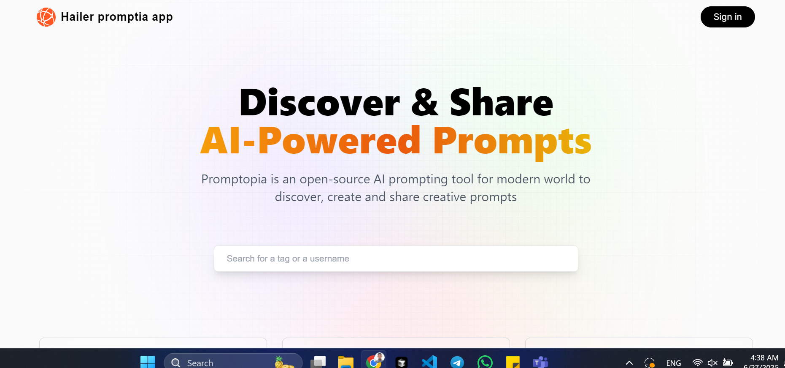
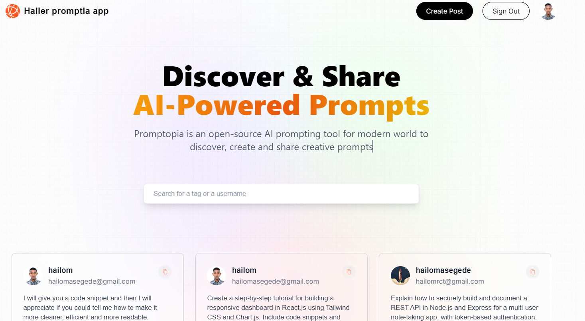
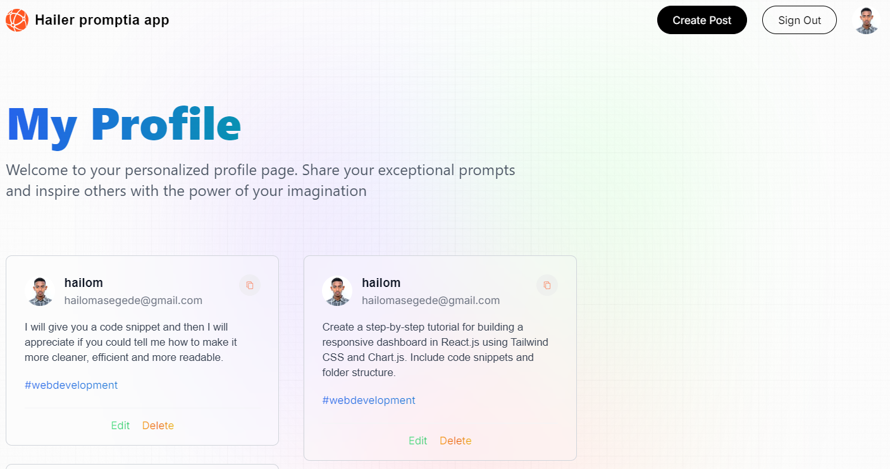

# 🚀 Hailer Promptia App- AI Prompt Sharing Platform

A modern, full-stack web application for discovering, creating, and sharing AI-powered prompts. Built with cutting-edge technologies and best practices.


## 🖼️ Screenshots

### Landing Page



### Home Page


### Profile Page



## 🎯 Key Features

- **🔐 Google OAuth Authentication** - Secure user authentication with Google
- **📝 AI Prompt Creation & Sharing** - Create and share AI prompts with the community
- **🔍 Real-time Search** - Search prompts by tags, usernames, or content
- **👤 User Profiles** - Personalized user profiles with prompt history
- **📱 Responsive Design** - Fully responsive across all devices
- **⚡ Real-time Updates** - Instant updates without page refresh
- **🎨 Modern UI/UX** - Beautiful, intuitive interface with glassmorphism effects

## 🛠️ Tech Stack

### **Frontend**

- **Next.js 14** - React framework with App Router
- **React 18** - Modern React with hooks and concurrent features
- **Tailwind CSS** - Utility-first CSS framework
- **NextAuth.js** - Authentication for Next.js

### **Backend**

- **Next.js API Routes** - Serverless API endpoints
- **MongoDB** - NoSQL database for data persistence
- **Mongoose** - MongoDB object modeling for Node.js

### **Authentication & Security**

- **Google OAuth 2.0** - Secure third-party authentication
- **JWT Tokens** - Stateless authentication
- **Environment Variables** - Secure configuration management

### **Development Tools**

- **ESLint** - Code linting and quality
- **PostCSS** - CSS processing
- **Autoprefixer** - CSS vendor prefixing

## 🚀 Getting Started

### Prerequisites

- Node.js 18+
- npm or yarn
- MongoDB Atlas account
- Google Cloud Console account

### Installation

1. **Clone the repository**

   ```bash
   git clone https://github.com/your-username/hailer-promptia.git
   cd hailer-promptia
   ```

2. **Install dependencies**

   ```bash
   npm install
   ```

3. **Set up environment variables**
   Create a `.env.local` file in the root directory:

   ```env
   GOOGLE_ID=your_google_client_id
   GOOGLE_CLIENT_SECRET=your_google_client_secret
   NEXTAUTH_URL=http://localhost:3000
   NEXTAUTH_SECRET=your_nextauth_secret
   MONGODB_URI=your_mongodb_connection_string
   ```

4. **Run the development server**

   ```bash
   npm run dev
   ```

5. **Open your browser**
   Navigate to [http://localhost:3000](http://localhost:3000)

## 📁 Project Structure

```
hailer-promptia-app/
├── app/                    # Next.js 14 App Router
│   ├── api/               # API routes
│   │   ├── auth/          # Authentication endpoints
│   │   ├── prompt/        # Prompt CRUD operations
│   │   └── users/         # User management
│   ├── create-prompt/     # Prompt creation page
│   ├── profile/           # User profile pages
│   └── update-prompt/     # Prompt editing page
├── components/            # Reusable React components
├── models/               # Mongoose data models
├── utils/                # Utility functions
├── styles/               # Global styles
└── public/               # Static assets
```

## 🔧 API Endpoints

- `POST /api/prompt/new` - Create new prompt
- `GET /api/prompt` - Fetch all prompts
- `GET /api/prompt/[id]` - Fetch specific prompt
- `PATCH /api/prompt/[id]` - Update prompt
- `DELETE /api/prompt/[id]` - Delete prompt
- `GET /api/users/[id]/posts` - Fetch user's prompts

## 🎨 Key Features Implementation

### **Authentication Flow**

- Google OAuth integration with NextAuth.js
- Automatic user creation in MongoDB
- Session management and JWT tokens
- Protected routes and API endpoints

### **Database Design**

- User schema with email, username, and profile image
- Prompt schema with content, tags, and creator references
- Optimized queries with MongoDB aggregation

### **Search Functionality**

- Real-time search with debouncing
- Search across prompts, tags, and usernames
- Case-insensitive search with regex

### **Responsive Design**

- Mobile-first approach with Tailwind CSS
- Glassmorphism UI effects
- Smooth animations and transitions

## 🚀 Deployment Options

### **Recommended: Vercel (Free Tier)**

```bash
npm install -g vercel
vercel
```

### **Alternative: Netlify**

- Connect your GitHub repository
- Build command: `npm run build`
- Publish directory: `.next`

### **Database: MongoDB Atlas**

- Free tier available
- Automatic backups
- Global distribution

## 📊 Performance Optimizations

- **Image Optimization** - Next.js Image component
- **Code Splitting** - Automatic route-based splitting
- **Server-Side Rendering** - Improved SEO and performance
- **Database Indexing** - Optimized MongoDB queries
- **Caching** - NextAuth.js session caching

## 🔒 Security Features

- **Environment Variables** - Secure configuration
- **Input Validation** - Mongoose schema validation
- **Authentication Guards** - Protected routes and APIs
- **CORS Protection** - Cross-origin request handling
- **XSS Prevention** - React's built-in protection

## 🤝 Contributing

1. Fork the repository
2. Create a feature branch (`git checkout -b feature/AmazingFeature`)
3. Commit your changes (`git commit -m 'Add some AmazingFeature'`)
4. Push to the branch (`git push origin feature/AmazingFeature`)
5. Open a Pull Request

## 📝 License

This project is licensed under the MIT License - see the [LICENSE](LICENSE) file for details.

## 👨‍💻 About the Developer

**Your Name** - Full Stack Developer

- 🔗 [LinkedIn](https://www.linkedin.com/in/hailom-asegede/)
- 📧 [Email](mailto:hailomasegede@example.com)

## 🙏 Acknowledgments

- Next.js team for the amazing framework
- Vercel for hosting and deployment
- MongoDB for the database solution
- Google for OAuth authentication

---

⭐ **Star this repository if you found it helpful!**

